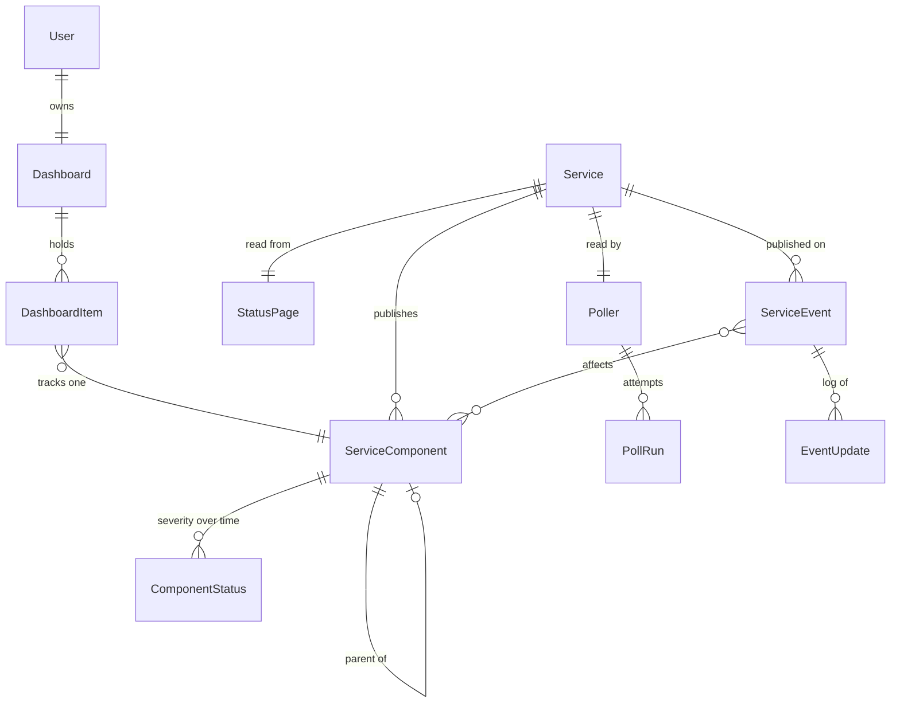
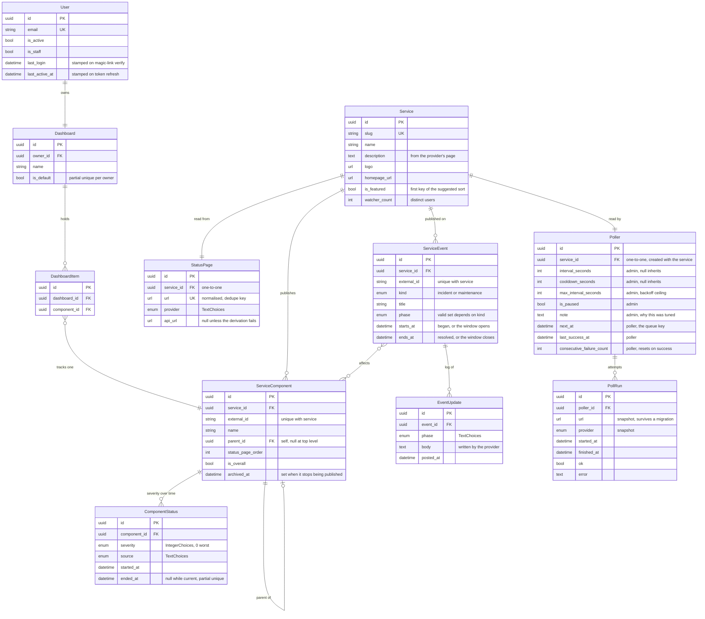

# Statusboard v1 — design spec

**Status:** approved design, ready for an implementation plan
**Date:** 2026-08-23

Statusboard is one place to see whether the services you depend on are working. You track
services from a catalog; the app refreshes them on a schedule and shows what is broken.

Designs, approved 2026-08-23:

- Mobile — <https://claude.ai/code/artifact/7900360b-d3bc-44ec-986b-d2152741c138> (Revision 51)
- Desktop — <https://claude.ai/code/artifact/f947e3ad-fcfc-4945-9bd5-38ca9284455c> (Draft 21)

---

## 1. Scope

### In v1

A personal status aggregator: sign in, track services or individual components, see their
current state, read the provider's incident log, and browse a public view without an account.

### Explicitly not in v1

| Deferred | Why |
| --- | --- |
| Shared dashboards, invites | Sub-project #2. The `Dashboard` model exists with one row per user so sharing needs no migration. |
| Community issue reporting, comments | Sub-project #3. The Figma set already contains `status dot - user reported`, a split-circle variant, so the dot component should accept a shape from day one. |
| Notifications | Sub-project #2. The Figma set contains a `Toggle Notifications` button; nothing in v1 uses it. |
| Uptime history charts | `ComponentStatus` accumulates from first poll, so any chart is empty on day one. Ships when there is data. |
| Service categories | Cut deliberately. `is_featured` plus `watcher_count` orders the suggested list instead. |

### Non-goals

Statusboard does not measure uptime itself. It reads what providers publish. Every number it
shows is theirs, not ours.

---

## 2. Architecture

Monorepo, matching caracara and codecity:

```
statusboard/
├─ api/                    Django 5 + DRF
│  ├─ api/                 settings, celery.py, urls
│  ├─ common/              BaseModel, pagination, schema, mixins
│  ├─ docs/                drf-spectacular + Scalar, served inside Unfold admin
│  ├─ authentication/      User, magic link
│  ├─ catalog/             Service, StatusPage, Poller, ServiceComponent, adapters/
│  ├─ dashboards/          Dashboard, DashboardItem
│  └─ status/              ComponentStatus, ServiceEvent, EventUpdate, PollRun, tasks.py
├─ app/                    React + TS + Vite + Tailwind + TanStack Query + vite-plugin-pwa
├─ justfile                infisical run --env=dev wrapping everything
└─ docker-compose.yml      postgres 17, redis 7
```

Dependency direction: `status` never imports users, `catalog` never imports dashboards. That is
what makes sharing a change to `dashboards` alone.

### House conventions to follow

- `uv`, `ruff` (`extend-select = ["I","F"]`), pre-commit with markdownlint and whitespace hooks
- `django-unfold`, with per-environment static dirs and `ENVIRONMENT` callbacks
- `drf-spectacular` + Scalar at `/docs/`, with tag-group,
  logo and schema-name postprocessing hooks and a markdown introduction
- `dj-database-url`, `python-dotenv`, `psycopg2-binary`, `django-cors-headers`, `django-filter`
- `django-simple-history` on `catalog` models only
- `django-celery-beat` with `DatabaseScheduler`, so poll schedules are editable rows in admin
- Redis as the Celery broker (caracara uses RabbitMQ; Redis is already needed for throttling)
- Skip social/OAuth entirely

---

## 3. Data model

Every model extends `common.BaseModel`: UUID primary key, `created_at`, `updated_at`,
`created_by`, `updated_by`, `ordering = ["-created_at"]`. `auth.Permission` and `ContentType`
keep integer keys — that is Django, not a choice.

### authentication



Every field and relationship:



Every model also carries `common.BaseModel`: `created_at`, `updated_at`, `created_by`,
`updated_by`. They are omitted above so the diagram shows what distinguishes each table.

Reading it:

- **A board row is a `ServiceComponent`**, never a `Service`. The overall component is one of
  these, so the arrow from `DashboardItem` has one destination.
- **`StatusPage` is separate from `Service`** because it is the *source*, and it is where the
  unique URL and the poller's state live.
- **`ComponentStatus` is append-only**, one row per severity change, with a partial unique index
  marking the current one. Current state and history are the same table.

- **`ServiceEvent` is one model for incidents and maintenance**, because a provider publishes them
  as one object. `kind` separates them; the API and the screens filter on it.


`User(BaseModel, AbstractUser)` with a UUID pk and email as the login field.

**Activity is tracked in two fields, both written without a per-request cost.**

`last_login` comes with `AbstractUser`, but Django only sets it inside
`django.contrib.auth.login()`, which magic-link auth never calls — it mints tokens on verify. It is
stamped explicitly there, or it stays null forever.

`last_active_at` is stamped on `POST /auth/refresh/`. The client rotates a 15-minute access token,
so that endpoint is already a heartbeat throttled to once per session per 15 minutes. No
middleware, no write on every request, no throttling logic to tune.

Neither is exposed on `/me/`; nothing in the app renders them. They exist for admin: seeing whether
an account is live, and finding dormant ones. Django's stock
`auth.Group`, unregistered and re-registered with Unfold's admin. No custom Group: it is not
swappable, and the thing worth extending later is `DashboardMembership` in `dashboards`, which
is a different concept from a permission role.

### catalog

- `Service` — slug, name, `description`, logo, homepage URL, `is_featured`, `watcher_count`

  `description` and `logo` come from the provider's page and are refreshed on every poll, so a
  rename or a rebrand upstream does not leave a stale entry in the catalogue. The service screen's
  About tab renders the description.

  `is_featured` is a boolean ticked in admin for services worth surfacing regardless of usage. It
  is the first key of the suggestion sort, and on day one — every `watcher_count` zero — it is the
  whole list.

  Two earlier fields are gone. `added_by` duplicated `BaseModel.created_by`, which every model
  already carries. `is_curated` had no consumer: nothing sorted, filtered or rendered by it.
  "Seeded by us rather than pasted by someone" is `created_by IS NULL`, and "worth surfacing" is
  `is_featured`.
- `StatusPage` — **its own model**, `OneToOneField` to `Service`. `url` (normalised, **unique**),
  `provider`, `api_url` (nullable override). What and where — nothing about polling.
- `Poller` — `OneToOneField` to **`Service`**, created with it. The thing that reads a service:
  how often, when next, and how it is going.

  On the service, not the page, for the reason `PollRun` is: the schedule answers "how often do we
  check Twilio", which outlives any particular page. A service migrating from Statuspage to
  Instatus keeps its tuning and its `note`, and the poller's schedule and its history stay at the
  same level.

  | field | who writes it |
  | --- | --- |
  | `interval_seconds` | admin — null inherits the `/meta/` default |
  | `cooldown_seconds` | admin — null inherits |
  | `max_interval_seconds` | admin — the backoff ceiling, null inherits |
  | `is_paused` | admin |
  | `note` | admin |
  | `next_at` | poller — the scheduler's queue key |
  | `last_success_at` | poller |
  | `consecutive_failure_count` | poller — resets to zero on success |

  ```python
  interval = service.poller.interval_seconds or meta.poll_interval_seconds
  ```

  **A null field means "inherit"**, and there is exactly one way to say it. An earlier draft made
  the row itself optional, so "not tuned" could be a missing row *or* a row full of nulls — two
  absences for one fact, plus a null check on the relation in front of every read.

  That is the layering a single effective column could not express: `/meta/` holds the deployment
  default, this holds a deliberate choice, and the effective interval is computed from both plus
  the backoff. Nothing before recorded that an admin *chose* 60s rather than inheriting 300s.

  Settings and state live together because they are one thing — the poller — read together on
  every pass. Splitting them was a second one-to-one row for the same object, which bought a join
  and nothing else.

  **`PollRun` hangs off the `Poller`**, not off `Service` directly. A run is an attempt this poller
  made, so its history belongs to it. The poller is one-to-one with the service and created with
  it, so that history still survives a page migration — which is what putting runs on `Service`
  was protecting.

  `is_paused` stops polling without deleting the service: a status page that has gone for good, or
  one rate-limiting us hard enough to be worth leaving alone. `note` is why — a tuned value with no
  reason attached becomes undeletable, because nobody later knows whether it still matters.

  `consecutive_failure_count` is a denormalised count of `PollRun`, kept because the scheduler
  reads it every cycle; deriving it would be a count-since-last-success query per service per tick.
  It drives the backoff that scales the interval, and tips a component to severity 3 once the data
  is too stale to trust.

  A `last_error` column was dropped for failing that same test: it is the newest `PollRun.error`,
  read only in admin, and a copy that can disagree with the row it came from.

- `ServiceComponent` — `service`, `external_id`, `name`, self-FK `parent`, `status_page_order`,
  `is_overall`, `archived_at`. Unique on `(service, external_id)`.

  `external_id` is the provider's own id for the thing, carried on components, incidents and
  maintenance windows alike. It says the id is **not ours**, which `status_page_component_id`
  would only say for components, and which `status_page_id` would say wrongly — that reads as a
  foreign key to `StatusPage`.

  There is no `is_group` flag: a component is a group when it has children, so the flag would be a
  second copy of a fact the tree already holds.

  `status_page_order` is the position the provider lists a component in, and it is the components
  tab's default sort. That ordering carries the provider's judgement about what matters —
  Twilio puts *Programmable Messaging* near the top and regional endpoints near the bottom.
  Sorted by name you get *API, Console, Elastic SIP, Lookup*, which is a different page from the
  one the user just came from. Severity and name remain available.

  It is also the only ordering that cannot be reconstructed later: it exists only in the payload
  being parsed, and one integer written during the upsert that already reconciles names and
  parents costs nothing to keep in step.

Custom URLs dedupe on `StatusPage.url`, so two users pasting the same status page share one
`Service` and one poll. A popular pasted entry is surfaced by ticking `is_featured` in admin.

**Suggestion ordering** is `(-is_featured, -watcher_count, name)`.

**`watcher_count` is distinct users, not items.** Someone tracking five Twilio components is one
watcher, not five:

```sql
SELECT COUNT(DISTINCT d.owner_id)
FROM   dashboards_dashboarditem i
JOIN   dashboards_dashboard d ON d.id = i.dashboard_id
WHERE  i.service_id = %s
```

It is recomputed for the one affected service on `DashboardItem` create and delete — a single
indexed aggregate, not a scan — so it is exact rather than drifting the way naive
increment/decrement would when someone adds a second component for a service they already track.
Deleting an account removes its items, which fires the same path.

A nightly reconciliation task recomputes every service as a safety net. It orders a suggestion
list, so a few hours of staleness costs nothing if a signal is ever missed.

On day one every `watcher_count` is zero, so the list is your featured picks followed by
everything else alphabetically. As real usage arrives the tail self-orders and you stop curating.
Nothing about the API changes at that point — it is the same query.

An earlier draft used a manual integer `featured_rank`. That is worse: it needs renumbering every
time something is promoted, and a value of 37 carries no meaning to whoever inherits it.

### dashboards

- `Dashboard` — owner, name, `is_default`. Exactly one per user in v1.

  ```python
  constraints = [
      UniqueConstraint(fields=["owner"], condition=Q(is_default=True),
                       name="one_default_dashboard_per_user"),
  ]
  ```

  `GET /me/` returns `default_dashboard_id`, which today can only mean "the only one". The flag
  makes it a real lookup, so the day a second board exists nothing about that endpoint changes.

  An earlier draft had `position` instead, left over from the multi-dashboard concept that was cut
  — it ordered boards in a switcher. With one board there is nothing to order, and a default is
  the part of that idea worth keeping.
- `DashboardItem` — dashboard, **component**

  Every row is a component. There is no nullable service field and no "is this a service or a
  component" discriminator, because a service's overall status is itself a component — see below.

  No `position`: nothing in the design lets you hand-order a board. Rows are sorted by severity or
  name, server-side. If manual ordering is ever wanted it arrives with the UI that needs it.

Unique on `(dashboard, component)`.

### Every service has an overall component

Statusboard creates one component per service, `is_overall = true`, `parent = null`, named
"All services". `path` is null, since it has no ancestry, and `child_count` is 0 — it is a peer of
the top-level components rather than their parent.

**`component_count` excludes it.** The number equals what the provider's own status page claims,
which is the number a user can check. The components list returns the overall row first and does
not count it in `aggregates.total`, so a page holds one more row than its count. It carries **the provider's own top-level indicator** — not an aggregate of its
siblings, because a worst-of rollup leaves Cloudflare permanently orange when one of 109
components is always degraded.

**Not every provider publishes one, so `status.source` says where a severity came from.**

| `source` | when | severity |
| --- | --- | --- |
| `provider` | the provider publishes a top-level status | theirs |
| `components` | it publishes component statuses but no top-level one | worst of the components |
| `incidents` | it publishes incidents only, no status at all | 2 if any incident is open, else 5 |

`incidents` is the RSS case. A feed we fetched is **not** unknown — it told us something. Clean
feed means nothing is reported wrong; an open entry means something is. What it cannot say is how
bad, so an open incident is `degraded` and no other severity is inferred from it.

`unknown` keeps its own meaning: we could not reach the provider. That is the only case where we
have no data at all.

**RSS ships in v1.** An RSS service shows only Operational or Degraded, and says so via
`status.source`. That is a narrower signal than a Statuspage service gives, but it is a real one,
and it is the difference between a service being in the catalog and not.

A screen showing a derived status says so. "Degraded" from a published indicator and "Degraded"
because an RSS entry exists are different claims, and a user who clicks through to a provider's
page and finds no status there should not feel misled.

This is why the board model is as simple as it is. "Track Twilio" and "track Twilio SMS" are the
same operation with a different id, so:

- A tracked row points at one thing, not one-of-two
- Every board endpoint is `/dashboards/{uuid}/components/`, because every row *is* a component
- A board row has no `kind` to branch on, and the client never picks an endpoint by row type

An earlier draft had items point at *either* a service or a component. That forced a
discriminator on every row, an either/or request body, and a client that had to decide which shape
to send. The overall component removes all three.

**There are no bulk endpoints and no aliases.** One `POST` creates one item; one `DELETE` removes
one. "Add all" and "Remove all" are the client repeating those calls, so there is never a decision
about which endpoint to use. The cost is honest: removing a service with 42 tracked components is
42 requests. They are small, they parallelise, and it is a rare action — cheaper than an API
where every add has two possible shapes.

### status

- `ComponentStatus` — append-only, one row per severity change. Each row is an interval:
  `started_at`, and `ended_at` which is null while it is the live one.

  ```python
  class Meta:
      constraints = [
          UniqueConstraint(fields=["component"], condition=Q(ended_at__isnull=True),
                           name="one_open_status_per_component"),
      ]
      indexes = [
          Index(fields=["severity"], condition=Q(ended_at__isnull=True), name="open_by_severity"),
      ]
  ```

  A change stamps `ended_at` on the open row and inserts a new one. Nothing is written when
  severity is unchanged, so a service that is fine all week costs no rows.

  **`ended_at IS NULL` is the only definition of "current".** An earlier draft carried an
  `is_current` boolean as well, which is two columns for one fact and two things to disagree.

  A closed row is then a self-contained interval. "Was it degraded at 14:00" is
  `started_at <= T < ended_at`, an index-friendly range query, and uptime is a sum of durations —
  neither needs a window function nor a lookahead to the next row.

  The partial unique index makes "exactly one open row per component" a database guarantee. The
  partial index on `severity` keeps Discover fast: `WHERE ended_at IS NULL AND severity <= 3`
  filters the whole catalogue without a latest-per-group query.

  The manager defaults to the open row. A query that wants history asks for it by name.
- `ServiceEvent` — FK to **`Service`**, `external_id`, `kind`, `title`, `phase`, `starts_at`,
  `ends_at`, M2M `affected_components`; `EventUpdate` child for the log

  **One model for incidents and maintenance windows**, because that is how providers publish them.
  On Atlassian Statuspage a scheduled maintenance *is* an incident — same object, a maintenance
  impact, a scheduled window, the same update log. Two tables meant two ingestion paths for one
  payload, and two near-identical shapes to keep in step.

  `kind` is `incident` or `maintenance`. `phase` is a `TextChoices` whose valid values depend on
  it: `investigating, identified, monitoring, resolved` for an incident; `scheduled, in_progress,
  verifying, completed` for maintenance. Validated on save, so the pair cannot drift into a
  meaningless combination.

  `starts_at` and `ends_at` are one interval either way — when an incident began and resolved, or
  when a window opens and closes. That is what lets one query answer "what is happening to this
  service between now and Thursday" without a union.

  **Both belong to the service, and both frequently name no component at all** — "Scheduled
  maintenance, Sunday 02:00" against the whole service, or "investigating elevated error rates"
  before anyone knows where. An FK to a component could hold neither, and would need six rows for
  an event touching six components. So `affected_components` is many-to-many, and
  `Component.active_incident` and `Component.upcoming_maintenance` are both **projections through
  it**, filtered by `kind`. On the overall component they cover the whole service, which is where
  an unattributed event appears.

  **The API is one collection too.** `/catalog/services/{slug}/events/` lists both, and `kind`
  filters. The service screen reads it twice: the Incidents tab with `kind=incident`, the
  Maintenance tab with `kind=maintenance`. Each groups by phase and renders each event's `updates`
  log, so `aggregates.by_phase` supplies the "ACTIVE 2" heading.

  Neither tab needs a count from this endpoint. `overall_component.active_incident_count` and
  `overall_component.upcoming_maintenance_count` arrive with the service, so the tab bar draws
  before either request is made — which is why `EventAggregates` carries no `by_kind`.

  Home's tabs do not use this endpoint at all. They filter components, because a board row is a
  component — see *The tabs are one axis*.

  Two endpoints would have been the same split as two tables, one layer up: two paths, two
  filtersets and two serializers over one model.

- `PollRun` — FK to **`Service`**, per-attempt success/error, plus the `url` and `provider` it
  actually fetched

  It answers "could we check Twilio", which outlives any particular page. A service that migrates
  from Statuspage to Instatus keeps its history; an FK to `StatusPage` would be one cascade from
  losing it.

  The snapshotted `url` and `provider` are what makes that history still readable afterwards — a
  run from before the migration says which page it read.

  `StatusPage` holds the rolled-up state (`poll_consecutive_failure_count`, `poll_last_success_at`); `PollRun`
  holds the attempts. This is what makes "everything is fine" distinguishable from "we have not
  successfully checked in six hours".

#### Four kinds of record, and how to tell them apart

Three of these are append-only logs, which is why they blur. What separates them is **whose record
it is and what it holds**.

| model | whose | holds | written when |
| --- | --- | --- | --- |
| `ComponentStatus` | ours | a severity, no prose | only when severity changes |
| `EventUpdate` | **theirs** | a paragraph they wrote, and a phase | when the provider posts one |
| `PollRun` | ours | did the fetch succeed, and of what URL | every attempt, success or failure |

`ComponentStatus` is us diffing two polls. `EventUpdate` is ingested verbatim, carrying the
provider's own `external_id`. They come apart constantly: a component flaps with no incident open
and you get status rows but no updates; a provider posts "monitoring a fix" while every component
reads operational and you get updates but no status rows.

`PollRun` is the third axis and is about neither — it records whether we could *read* the page. It
is what makes "everything is fine" distinguishable from "we have not successfully checked in six
hours", which look identical if you only store status.

An earlier draft split current state and history into two tables, `ComponentStatus` and
`StatusEvent`, so that filtering the catalogue by current severity had a small table to index. The
partial index does that in one table, and removes the risk of the two disagreeing — there is only
one write path now, and the unique constraint enforces the invariant that the two-table version
asked the polling code to maintain.

**Nothing is written on an unchanged poll.** A row per poll would be 12 components × 288 polls a
day, about 630M rows a year across 500 services, nearly all identical to the row before them.
"When did we last check" does not need to be there: `StatusPage.poll_last_success_at` answers it,
because one fetch covers every component of a service.

### Status and incidents are different things

They are not derived from each other and neither is computed from the other.

A **status** is the current state of a service or component, as the provider reports it —
`operational`, `degraded`, and so on.

An **incident** is the provider's narrative record: a title, a start time, affected components,
and a running log of updates. Its `phase` is workflow — `investigating`, `identified`,
`monitoring`, `resolved`.

They move independently. A provider can be `monitoring` a fix while every component already reads
`operational`, and can report `degraded` with no incident open at all. Statusboard shows both and
never infers one from the other — which is why the service screen has separate Components and
Incidents tabs rather than one merged list.

### Every fixed set is a choices class

`severity` is `models.IntegerChoices`; `status.source`, `status_page.provider` and `incident.phase`
are `models.TextChoices`. None of them is a bare string with values enforced by convention.

That is what lets a set grow in one place. Adding a provider means one line in the class, and
Django, drf-spectacular and the admin all pick it up — the OpenAPI `enum`, the admin filter and the
validation come from the same declaration. `severity` as `IntegerChoices` also puts the labels next
to the numbers, which is where `/meta/` reads them from.

The `PollRun.provider` snapshot uses the same class, so a historical row is readable against the
current vocabulary rather than being a loose string nobody validates.

### Normalised status

| Status | Severity | Colour |
| --- | --- | --- |
| `major_outage` | 0 | `#E51F00` |
| `partial_outage` | 1 | `#E58900` |
| `degraded` | 2 | `#E58900` |
| `unknown` | 3 | `#808080` |
| `maintenance` | 4 | `#00A0E5` |
| `operational` | 5 | `#00E54D` |

**Lower is worse**, matching the SEV0/SEV1 convention people arrive with. Sorting worst-first is
`ORDER BY severity ASC`, and `severity <= 3` is everything needing attention — which is also why `unknown`
sits at 3 rather than beside `operational`: a service we cannot reach belongs with the problems,
not with the healthy ones.

**An "All services" row uses the provider's own top-level indicator, never the worst of its
components.** A worst-of-components rollup leaves Cloudflare permanently orange, because something among
109 components almost always is.

---

## 4. Provider adapters and polling

### Adapters

One class per provider, same interface: given a URL, return normalised components and incidents.

- `StatuspageAdapter` — Atlassian's `/api/v2/summary.json` and `/api/v2/incidents.json`. Covers
  most of the industry.
- `InstatusAdapter`, `BetterStackAdapter`
- `RSSAdapter` — fallback. Returns incidents and no component status. Its services get one
  synthetic component, the overall one, with `status.source = incidents`: severity 2 while an
  incident is open, severity 5 otherwise.

Each exposes `fetch_status()` and `fetch_incidents()`. Adding provider #5 is one new class.

`POST /catalog/import/` detects the provider from a pasted URL and creates the service.

### Keeping names and component trees current

Providers rename services, add components and retire them. A poll is therefore a reconciliation,
not just a status read.

Each successful poll:

1. **Upserts components by `external_id`.** New ones are created, renames are applied, and the
   parent/child structure and `status_page_order` are refreshed.
2. **Marks vanished components `archived_at`** rather than deleting them. Someone may be tracking
   one, and deleting the row would silently remove it from their board. An archived component
   still renders, reads `unknown`, and says the provider no longer publishes it.
3. **Refreshes the service's own metadata** — name, description, logo — for seeded and pasted
   entries alike, so a rename upstream does not leave a stale name on someone's board.

Component identity is the provider's `external_id`, never the display name. Names change; ids do
not, and matching on names would orphan a tracked row the first time a provider edits its wording.

### Polling

**There is one global schedule, not a schedule per user or per dashboard.** A service is polled
because *someone* tracks it, not because a particular board is open. Two hundred users tracking
Twilio produce one poll every five minutes, not two hundred.

`django-celery-beat` on `DatabaseScheduler`. Rules:

- Poll only services with at least one watcher
- Five-minute default interval, with jitter so we do not stampede
- Honour `ETag` / `If-Modified-Since`
- Exponential backoff on failure. **The service screen shows the effective interval, not the
  deployment default** — `Service.poller.interval_seconds`. A service in backoff is not being
  checked every five minutes, and that is precisely the service someone opens to ask why.
- **A hard per-service cooldown, global across all users**

A failed fetch sets `unknown` and **never clobbers the last known value**. The UI shows the grey
state plus how long it has been stale.

Why the cooldown lives on the service rather than the dashboard or the user is specified in §5
under **There is no manual refresh**.

A poll also captures the service's **logo** from its own page. A favicon belonging to the parent
company rather than the product — Google's mark for Google Slides — is discarded rather than
stored: a wrong logo misidentifies the row, while a missing one falls back to an initial and
merely looks incomplete.

## 5. API surface

**The contract is [`docs/api/openapi.yaml`](../api/openapi.yaml)** — 15 operations, 16 schemas,
with every parameter and response shape. It is the single source of truth; drf-spectacular will
generate it from the code, and it is served through Scalar at `/docs/` like your other
projects. This section records only the decisions behind it, so the two cannot drift.

### Identifiers

`GET /me/` returns your `default_dashboard_id`, and the client goes straight to
`/dashboards/{uuid}/components/`. The name says *default* rather than *the* because v1 having one
per user is a product decision, not a schema one.

**There is no `GET /dashboards/{uuid}/`.** The board's own fields — `name`, `is_default` — are not
rendered anywhere: the header says "Home", not the dashboard's name. An endpoint returning three
unused fields is a request nobody makes.

It arrives when a board is shared, because a recipient needs its name and its owner, and the URL
is already the one sharing will use. Adding it then is additive; shipping it now is a guess.

**UUID is the identity for every model**, from `common.BaseModel`. Path parameters are UUIDs
everywhere except one: `Service` also carries a stable `slug`, used on public catalog routes,
because those URLs get shared during an outage and a UUID would be hostile there. Anything the
user owns stays UUID, so nothing personal is enumerable. Writes always address the UUID.

An import derives the slug from the host and de-duplicates on collision (`linear`, `linear-2`).

**`POST /catalog/import/` creates a service from a status page URL.** It detects the provider,
creates the `Service`, its `StatusPage` and its components, and returns the service — `201` when it
created one, `200` when the URL already resolved to one. Nothing is stored about the attempt.

**`POST /catalog/services/` is deliberately not defined.** Creating a service has several possible
inputs: a URL, a filled-in form, a bulk file. Each takes a different body, so each needs its own
path. If the plain collection `POST` meant "from a URL", the other two would have to invent names
while the standard endpoint sat spent on one special case.

So none of them takes it. That is a reservation with three known claimants, not a guess about the
future.

An earlier draft called this `resolve/`, which named the mechanism rather than the thing being
made.

`Import.service` is the **same shape the catalog list returns**, not the detail shape. One service
representation, whatever produced it — so a client can drop an imported service straight into the
list it already renders.

That forced the status page fields down into the list shape, because the Add-by-URL screen shows
them in its About block before you press ＋. What was left of `ServiceDetail` — `description` and
`in_catalog_since` — has since folded into `Service` as well, for the reason below.
Renaming keeps the old slug as a redirect rather than breaking shared links.

### Severity is the state, and there is no status string beside it

An earlier draft carried both a `severity` integer and a `status` string on every row. Two fields
for one fact can disagree, and one of them is always the redundant copy. Only the integer is
transported; `/meta/` publishes the 0–5 label map once and the client renders from it, so a label
change ships without touching a serializer.

`status__severity__lte=3` is everything needing attention; `status__severity=4` is maintenance.
There is no named band parameter — a band is just a threshold, and a client can compose
any other one without waiting for a new enum value. `aggregates.by_severity` returns the raw histogram for the same
reason.

### One list, several screens

Discover, the suggested lists and the public "down right now" view are the same catalog query with
different parameters. Suggestions are not a separate concept: they are the list with no `q`, sorted
`(-is_featured, severity, -watcher_count, name)`.

Severity sits ahead of popularity deliberately — a mid-popularity service that is currently broken
is more worth surfacing than a more popular one that is fine, which is the whole premise of the
public view.

### Components are their own collection

Cloudflare publishes 109 and nothing caps that, so the service detail reports `component_count`
and the Components tab pages through `/components/`. The tab labels come from the service —
`component_count` and `tracked_component_count` — not from `aggregates`. A
component is a group when `child_count > 0`; there is no separate flag.

### Filtering, sorting and pagination are server-side, without exception

There is no cap on board size — one service can contribute 109 components — so the API never
assumes the board fits in one response. `aggregates` covers the whole collection rather than the
page, so a chip is correct on page four.

There is no client-side fallback. One rule, one implementation.

### There is no manual refresh

An earlier draft had `POST /refresh/` behind a header button and a **Refresh now** row menu item.
Both are gone. Reloading the page already shows the freshest data the poller holds, so the button
bought a second path to the same result and carried its own cooldown handling, its own signed-out
routing, and its own failure state.

**A page load reads stored state. It never triggers a poll.** Every `GET` serves what the last
poll wrote, so the data a reader sees is at most one `interval_seconds` old and the response time
does not depend on a third party being reachable. The alternative — a `GET` that polls anything
stale and waits — would delete the button while moving its cost into every page view, including
the failure mode where someone else's status page is slow.

**What is kept is the freshness itself.** The header pill still reads "2 min ago" from
`aggregates.oldest_refreshed_at` — the age of the *stalest* row, not an average, so the number is
a floor rather than a flattering middle. Since nothing can be pressed, the pill also answers when
that improves: hovering shows "next check in 3 min" from `aggregates.next_refresh_at`, the soonest
`Service.poller.next_at` in the collection.

**The cooldown stays on the service, globally.** The thing needing protection is somebody else's
status page, and a per-user or per-board limit would poll one service twice for two boards that
both track it.

It still has a user-triggered path to guard, just not this one: `POST /catalog/import/` fetches
the URL to detect the provider and read the component list. That is a stranger's request causing
a fetch of a stranger's server, which is the case the cooldown exists for. It also keeps an
import's first poll from stacking on the scheduled one.

### Sparse fieldsets are a framework concern

Every endpoint that returns a body accepts `?fields=`. `?fields=id,name,overall_component.status.severity`
returns those three and nothing else. A dotted path prunes inside a nested object rather than
dropping it.

**This is baked in at the base layer, not written per view.** A `FieldsMixin` on the base
serializer reads the parameter and prunes `self.fields` in `__init__`; a filter backend declares
it so drf-spectacular documents it on every operation without annotation. A view that must not
support it sets `fields_param = None`.

That matters because the alternative is 13 operations each remembering to add it, and the one that
forgets is the bug. It also keeps the OpenAPI honest: the parameter appears everywhere it works
and nowhere it does not, because both come from the same declaration.

An unknown field name is a `400`, not a silent empty response. A client asking for a field that no
longer exists should be told.

### The status page is its own model

`StatusPage` is a model, `OneToOneField` to `Service`, serialized as `Service.status_page`. It
holds the source and how we read it, separately from what we read:

```jsonc
"status_page": {
  "url": "https://status.twilio.com",
  "provider": "statuspage",
  "poll_last_success_at": "…",
  "poll_next_at": "…",
  "poll_interval_seconds": 300,
  "poll_cooldown_seconds": 60,
  "poll_consecutive_failure_count": 0
}
```

Three loose `status_page_*` fields became one model, and the polling facts that had nowhere
sensible to live joined them. The nesting follows the same rule as everything else here — one
schema, one model — rather than being a serializer that groups fields for looks.
`poll_interval_seconds` was a loose field on the service purely because the About tab shows
"Refreshed every"; it belongs here, next to the backoff that changes it.

The split is between **the source and the data**. `status_page` is where a service's information
comes from and how reliably we are getting it. `overall_component` is the information. A screen
explaining *why* a status is stale reads the first; a screen showing status reads the second.

`poll_consecutive_failure_count` and `poll_next_at` make staleness explainable rather than mysterious — the
difference between "Can't check" and "Can't check, we have failed four times and will try again in
twenty minutes".

`/meta/` keeps deployment defaults for both intervals. A single page can differ from them.

### A component carries everything happening to it

Three things happen, and a component carries all three:

| | on `Component` | how many |
| --- | --- | --- |
| its current state | `status` | — one by definition |
| scheduled work | `upcoming_maintenance` | `upcoming_maintenance_count` |
| a live problem | `active_incident` | `active_incident_count` |

**A count sits with the projection it counts, over the same set.** A card shows the soonest
unfinished window and the most recent unresolved incident; the counts turn those into "+2 more"
without shipping either list. Both are scoped to what is still live — a count over a wider set
than the item beside it produces "+3 more" pointing at nothing the screen can reach, which is what
happened when `active_incident` was `latest_incident` and returned resolved ones. Both live on
the component, so a board row has them whatever it tracks.

**The overall component carries the same three, scoped to the whole service.** Its
`upcoming_maintenance` is the soonest unfinished window anywhere in the service, from any
component. Its `active_incident` is the most recent unresolved incident anywhere in it.

**Tracking the overall component means one card for the service**, instead of one per component.
That is the point of it, and it is why the card compresses: a service with three maintenance
windows still gets one row.

The row shows `upcoming_maintenance` and, when `upcoming_maintenance_count` is above one, "+2
more". **Windows are never merged into a combined span** — two windows a week apart are two facts,
and a single merged window would be true of neither. Same for incidents: the row shows
`active_incident` and `active_incident_count` says whether there are others.

Neither is accompanied by an array. History is unbounded, a row renders from the soonest plus a
count, and the full list is `GET /catalog/services/{slug}/events/` with `kind`.

That is what makes tracking a service as a whole work. A board row is a component, so a row for
Twilio's overall component must answer "is anything scheduled, is anything broken" for Twilio —
otherwise following the whole service tells you *less* than following one part of it, which is
backwards.

An earlier draft put the maintenance summary, the incident summary and `active_incident_count` on
`Service` instead. All three are gone: a `Service` nests `overall_component`, and the same values
are read there. One fact, one place, and the board gets them for free because a board row already
is that component.

Real components are scoped normally — `upcoming_maintenance` is that component's own soonest
unfinished window, and `active_incident` is the most recent unresolved incident naming it through
the `affected_components` M2M.

**The projection runs one way only.** A component carries its event; an event does not carry its
components. `ServiceEvent.affected_component_ids` used to ship the ids on every row and no screen
read them — the event tabs render titles and update logs, never component names. The M2M filter
`?affected_components=` stays, since django-filter generates it free and narrowing events to one
component is a query a screen may want. The field was a prefetch and bytes for nothing.

### One envelope, and aggregates that grow without changing it

Every list returns `{ aggregates, next, results }`. `aggregates` is the one place for anything
computed over the **whole collection** rather than the page.

An earlier draft had `counts` and `oldest_refreshed_at` sitting side by side at the top level,
which is two aggregations at two different depths. The next figure worth showing would have been a
third key, and a client could not read them generically.

```jsonc
{
  "aggregates": { "total": 42, "by_severity": {"0": 1, "5": 38}, "oldest_refreshed_at": "…" },
  "next": "cursor…",
  "results": [ … ]
}
```

`Aggregates` defines the floor — `total`, present everywhere, so it can be read without knowing
which endpoint produced it. An endpoint extends rather than replaces: `StatusAggregates` adds the
severity histogram and `oldest_refreshed_at`; `EventAggregates` adds a histogram by phase.

**Every chip on a screen must be answerable from one response.** Home has three — All, Incidents,
Maintenance — and the first fetch has to fill all three, or the client makes a request per chip
before it can draw the row of chips.

`total` gives All. The other two come from `by_event_kind`, which counts the rows each value of
`event` returns. Neither can be read off `by_severity`: a maintenance window three days out leaves
the component at severity 5, and a provider can open an incident on components it still reports as
operational.

The rule that follows: **if a filter cannot be derived from an existing aggregate, it needs its own
aggregate.** A chip is a filter and a count, and shipping one without the other means the screen
cannot be drawn in one request.

**An aggregate has to mean the same thing on every endpoint that returns it.** A `tracked` count
was dropped for failing that: on a service's components it duplicated
`Service.tracked_component_count`, and on the board it always equalled `total`, because everything
on a board is tracked by definition. Either a duplicate or a tautology, depending on the caller. A new list endpoint declares its own subclass and the envelope never changes shape.

In DRF this is one pagination class emitting the three keys, with each viewset supplying
`get_aggregates(queryset)` — so adopting the shape is a method, not a new response schema.

The rule that makes it worth having: **nothing collection-wide is ever added at the top level.**
A figure that describes the whole collection goes in `aggregates` or it does not ship.

### One schema, one model

Serializers are `ModelSerializer`s, so the API shape has to be something a `ModelSerializer` can
actually produce. Every schema therefore maps to a single model, and **related models nest under a
key rather than flattening into the parent**.

`status` is the case that forced the rule. Severity, `started_at` and `last_refreshed_at` live on
`ComponentStatus`, a separate table from `Component` and further still from `Service`. An earlier
draft merged them into the parent object, which reads fine as JSON but is a hand-assembled
serializer with `source=` on every field and no model behind it. Nested, it is one
`StatusSerializer` over one model, reused on both parents — and a `Service` reaches its status through
the overall component, which is the job that component was introduced for.

The rule applies transitively, which is easy to miss. A `Service` has no status of its own — its
status *is* its overall component's. An intermediate draft gave `Service` a `status` key with
`source="overall_component.status"`, reaching through a relation to hoist fields onto the parent: the same
mistake one level up. It also carried `overall` as a bare id and `is_tracked` as a third field
describing that same component. All three collapse into one nested object:

```jsonc
"overall": { "id": "…", "status": { "severity": 1, … }, "is_tracked": true },
"tracked_component_count": 3
```

One FK, one nested serializer. The response path and the filter path become identical —
`overall_component.status.severity` is read at `?overall_component__status__severity__lte=3`.

**Tracking is two questions, not one.** Whether the *overall* component is tracked is what the ＋
on a service row toggles; whether *anything* from the service is tracked decides if it appears on
your board. You can track Twilio SMS without tracking Twilio as a whole. The first is
`overall_component.is_tracked`; the second is `tracked_component_count > 0`, so no second boolean is carried
for something the count already answers — and the same count renders the "3 tracked" label.

The count **includes the overall component**, because overall is a component like any other.
Excluding it would reintroduce the service-versus-component split this design exists to remove.

### One schema per model, and reference schemas where nesting forces them

There is no list variant and detail variant of the same resource. `ServiceDetail` was `Service`
plus `description` and `in_catalog_since`; `TrackedComponent` was `Component` plus `service`.
Both withheld fields that cost nothing — plain columns, or a `select_related` join — so both
folded into the resource they extended. Trimming a response is `?fields=`, where the client
chooses, rather than a second schema deciding for it.

`OverallComponent` went the same way. `Service.overall_component` is a plain `Component`, so a
component has one shape everywhere and one renderer draws every row. Six of its fields are fixed
by what an overall component is — `parent` and `path` null, `child_count` 0, `is_overall` true,
`archived_at` null, `name` the service name — and they are returned rather than omitted. A client
that special-cased them would need a second renderer to gain nothing.

**Reference schemas are a different thing and they stay.** `ServiceRef` and `EventRef` are not
smaller variants of a resource; embedding the full one is impossible or unbounded:

| Schema | Fields | Why it cannot be the full resource |
| --- | --- | --- |
| `ServiceRef` | id, slug, name, logo | `Component.service`. A `Service` nests `overall_component`, which is a `Component`, which nests its service — a full `Service` there never terminates. `ServiceRef` nests nothing, which is what ends the chain. |
| `EventRef` | id, kind, title, phase, starts_at, ends_at | `active_incident` and `upcoming_maintenance`. A full `ServiceEvent` carries `updates`, a reverse FK with no bound — the same reason the maintenance array was removed. |

The test is whether the omitted fields are *unavailable* or merely *unwanted*. Unavailable is a
reference schema. Unwanted is `?fields=`. `OverallComponent`'s were neither: they were available
and wanted, just constant.

`allOf` survives in only one role: a serializer subclassing another **over the same model**. It
never merges two models into one flat object.

Query parameters use the ORM path, and the nesting is visible in the URL on purpose.

```python
filterset_fields = {"status__severity": ["exact", "lte"]}   # ?status__severity__lte=3
ordering_fields  = ["status__severity", "name", "updated_at"]
```

That is django-filter's zero-config behaviour. Renaming them to `severity_lte` buys a shorter URL
and costs a declared `NumberFilter` per field per viewset — a `FilterSet` class to write and keep
in sync every time a field is added. The ORM path also means a client can read a response body and
derive the filter for anything in it, including fields that do not exist yet.

**The tabs are one axis, and severity is a filter that works inside any of them.** An earlier
draft named them All, Outages and Maintenance. Those straddled two axes: Outages filtered status,
Maintenance filtered events, and All filtered nothing. Every difficulty came from that — the
Maintenance filter had to be hand-written to span a status field and an event relation, and its
count could not come out of `by_severity`.

Incidents and maintenance are both `ServiceEvent`. Naming the tab after the model puts all three
on the event axis: `event=incident`, `event=maintenance`, and no parameter for All. One generated
filter, one symmetric aggregate.

Severity then composes with any tab rather than competing with one.
`event=incident&status__severity__lte=3` is written-up incidents that are also down right now.

`event` is one of the declared filters, and the reason is a Django rule rather than a preference.
`ServiceEvent` and `ServiceComponent` are many-to-many. django-filter applies each query parameter
as its own `.filter()` call, and on a many-to-many every call joins the relation again — so
`?events__kind=incident&events__phase__in=…` lets the two conditions land on two different events.
A component holding one closed incident and one running maintenance satisfies both and matches
neither. The conditions have to sit in a single call:

```python
def filter_event(self, qs, name, value):
    return qs.filter(
        events__kind=value,
        events__phase__in=ServiceEvent.OPEN_PHASES,
    ).distinct()
```

`.distinct()` because the join returns a component once per matching event.

**What each tab can promise.** A provider can drop a component to *Major outage* without writing
an incident, and that row will not appear under Incidents. So the tabs divide as:

| Tab | Answers |
| --- | --- |
| All | What is wrong — sorted worst-first, whether or not anyone wrote it up |
| Incidents | What has been written up |
| Maintenance | What is planned |

All is the one that promises completeness, which is why its default ordering is `status__severity`
ascending. Incidents is the narrative, not the alarm.

Four parameters cannot follow the rule and are declared: `tracked_component_count__gt` and
`overall_component__is_tracked` are per-user annotations with no ORM path behind them, and
`ordering=suggested` is a multi-key sort. Everything else is generated.

Because these paths are public, **a model field name is an API decision.** It appears in
`?fields=` and in every filter path built from it, so it is chosen to be read, not just stored.

### What belongs to the user, the device, and the deployment

Three things were sitting on `/me/` that are not user data, and each moved:

- **Theme is per device.** Someone runs dark on their phone at night and light on a desktop in a
  bright office; syncing it as an account preference makes one of those wrong. It lives in that
  browser's local storage and never reaches the server.
- **Poll interval is deployment-wide**, not a preference. A user cannot make us hit somebody
  else's status page more often, so it was never theirs to set.
- **The severity label map, page sizes and refresh cooldown** are the same for everyone.

Those now come from `GET /meta/`, fetched once at app start and cacheable. It also means the 0–5
labels have exactly one home. What is left on `/me/` is genuinely personal and small: id, email,
`default_dashboard_id`. Nothing on it was patchable once theme left, so `PATCH /me/` is gone —
`GET` and `DELETE` are the whole resource.

### Public access

Catalog and incident endpoints are readable without a token; that data is not personal.
`is_tracked` comes back `null` rather than absent, so the client renders `＋` without a second code path.
Adding, refreshing, `/me/` and `/dashboards/` require auth, and public endpoints carry their own
caching and rate limits.

### Screen-to-endpoint map

| Screen | Calls |
| --- | --- |
| Home · All | `GET /dashboards/{uuid}/components/` |
| Home · Incidents | `…/components/?event=incident` |
| Home · Maintenance | `…/components/?event=maintenance` |
| Home, signed out | `GET /catalog/services/?overall_component__status__severity__lte=` |
| Header pill | no call — `aggregates.oldest_refreshed_at` and `next_refresh_at`, both already in the list response |
| Row ⋮ → Stop tracking | `DELETE /dashboards/{uuid}/components/{component_id}/` — the only item left in that menu |
| Discover, suggested | `GET /catalog/services/` |
| Discover, Tracked filter | `GET /catalog/services/?tracked_component_count__gt=0` |
| Discover, typing / no results | `GET /catalog/services/?q=` |
| Add by URL | `POST /catalog/import/` |
| Service · Components + filter | `GET /catalog/services/{slug}/components/?is_tracked=` |
| Service · Incidents | `GET /catalog/services/{slug}/events/?kind=incident` — both groups; the tab renders ACTIVE and RESOLVED, so it must not filter on `ends_at__isnull` |
| Service · Maintenance | `GET /catalog/services/{slug}/events/?kind=maintenance` |
| Service · About | `GET /catalog/services/{slug}/` — Website, Status page, Provider, Components, Active incidents, In catalog since, Refreshed every |
| Service · Add all / Remove all | the same `POST` / `DELETE`, repeated per component |
| ＋ on any row | `POST /dashboards/{uuid}/components/` |
| Sign in | `magic-link` → `verify` |
| App start | `GET /meta/` |
| Settings | `GET /me/`, `GET /meta/`, `DELETE /me/`; theme is device-local |

### The row is one component, used everywhere

Home, Discover and the service screen render the same card. Line one is the mark and the name;
line two is the status and its duration; line three is context. Nothing shares a line, because a
232px phone row cannot hold two things that must not truncate.

**Line three is the only variable, and what it holds follows from what the row is.**

| the row is | line three |
| --- | --- |
| a service you track nothing of | `7 components` — what is on offer |
| a service you track part of | `Tracking [overall] [3 of 42]` |
| a component on your board | its parent breadcrumb, `Twilio › Programmable Messaging` |

A board row never shows a tracking count. The count answers *how much of this service am I
watching*, which is a question about a **service**; a board row is already one tracked component,
so the answer would always be "this one".

Tracking state renders as **one token per subscription** rather than a sentence — `overall` for the
summary row, `3 of 42` for components, both when you take both. That maps one-to-one onto
`overall_component.is_tracked` and `tracked_component_count`, so the client assembles no strings, and "all"
is simply `118 of 118` with no extra vocabulary.

**The duration is always shown**, including on operational rows, where it reads as time since the
service last left operational — the same `status.started_at` every other state uses. Maintenance is
the one case that would state its timing twice, so its window renders in that slot rather than
below, and always relatively: `in 4 hrs` before it starts, `ends in 40 min` while it runs.

**The overall component is titled by where you are standing.** On a service screen the header
already says Twilio, so the row is `Overall status` with `All services` beneath. On your board
nothing else names the service, so it is `Twilio` with `Overall status` beneath. Same component,
same `is_overall` flag, different useful title.

**Marks appear only where rows come from different services** — Home and Discover. On a service
screen every row belongs to the same service, so forty-two identical marks are noise and the slot
is dropped. Where a service has no usable logo the row falls back to its initial in the same
circle, so a list with patchy coverage keeps one left edge.

## 6. Frontend

React + TS + Vite + Tailwind + TanStack Query + `vite-plugin-pwa`.

### Navigation

Three destinations: **Home**, **Discover**, and a third slot that is **Sign in** when logged out
and **Settings** when logged in. Signed out and signed in are the same screens; only the buttons
differ.

- Mobile: bottom pill, inset to the content width, fully rounded
- Desktop: top bar; Sign in sits right as a primary button

### Screens

| Screen | States |
| --- | --- |
| Home | All · Incidents · Maintenance; empty, unreachable, row menu |
| Discover | suggested, typing, no results |
| Add by URL | detected, not found |
| Service | Components · Incidents · Maintenance · About; not tracked, outage, unknown |
| Sign in | request, check your email, verify |
| Settings | preferences, account, install |

### Chips and filters

`All` · `Incidents` · `Maintenance`. The two named tabs filter on event kind; All applies no
filter and sorts worst-first. Counts describe whatever the tab shows: the catalog when signed out,
your tracked set when signed in. Signed out shows no counts, because nothing is yours.

**Colour follows the dot, and the dot is always the true severity.** Maintenance already under way
is severity 4, so its row is blue and reads "Maintenance ends in 2 hrs". Maintenance three days out
leaves the component operational, so its row is **green** and reads "Maintenance in 3 days". The
tab decides which fact the line describes; severity decides what colour it is. A row never shows a
colour the component is not in.

Sort is **Smart** by default (`ordering=suggested`): tracked first, then severity ascending
(worst first), then name.

### No offline mode

Statusboard reports on remote services. With no network there is nothing true to report — a cached
board would show yesterday's answer to today's question, which is worse than saying nothing.

So there is no stale-cache mode, no offline banner and no dimmed rows. A failed request shows a
plain "can't reach statusboard" state with a retry. The service worker exists only to make the app
installable; it does not cache API responses.

The `unknown` status is a different thing and stays: that is *our* server failing to reach a
provider, which we can report accurately because we are online and they are not.

### Install

No prompt on first visit. A dismissible banner on the third visit, plus a row in Settings.
**iOS has no programmatic install prompt**, so Safari gets "tap Share, then Add to Home Screen"
while Android and desktop Chrome get a real button.

---

## 7. Design system

### Vocabulary

**You track. The app refreshes. The catalog gets no verb.**

- `＋` starts tracking; `⋮` opens the menu that stops it. No tick, no lock icon.
- Signed out, `＋` is still `＋` and opens Sign in.
- "Refreshed every 5 min", never "updated" — the Incidents tab already uses *updates* for
  provider posts — and never "monitored".
- "In catalog since", never "tracking since".

### Row anatomy

Identical on both platforms; desktop only changes the container.

```
[logo]  Twilio                        ●
        Major outage · 38 min
        42 components                 ⋮
```

- **Logo** top-left, neutral disc with an initial. Only where rows come from different services —
  on a service screen every row is the same service, so the slot is dropped. No provider publishes
  per-component icons.
- **Status** in words, in its severity colour, with duration in mono beside it
- **Meta** last: `42 components` for a service, the breadcrumb for a component,
  `Overall status` for the rollup row. **On the Maintenance tab every row shows its window
  instead**, in local time.
- **Dot** 15px, top-right. **Action** bottom-right.

The subtitle says what the row *is*, never what you have done with it.

### Colour

| Token | Value |
| --- | --- |
| Ground | `#F5EDD6` |
| Card | `#FFFFFF` |
| Nav / ink | `#29140A` / `#0D0D0D` |
| Accent | `#32CDB3` (notifications toggle only) |

Status dots use the palette above at **80% fill opacity**, as Figma sets them.

**Status text uses darkened variants** — `#1C7A3E`, `#A35F00`, `#B3180B`, `#0B6EA0` — because
`#00E54D` on white is about 1.8:1 and unreadable at 11px. Dots keep the exact Figma colours.

Rules:

- Status colour is visible wherever services are listed, including the catalog
- Green means operational and nothing else — buttons use brand dark
- Count pills are grey: a count is a quantity, not a severity
- Secondary buttons are transparent with a `#D6CCB8` border; primary is dark fill

### The mark

The statusboard logo carries the status dot wherever it appears — brand row, tab bar, favicon,
app icon. **One dot, the lower-left counter**, coloured by the worst status you track. It is the
position your artwork already varies (red and grey); the upper-right is green in every variant.
Scheduled maintenance keeps it green — planned work does not need you.

Signed out, nothing is tracked, so the counter stays hollow.

### Icons

Home and Discover use the Figma marks. Settings and Sign in use Lucide (`settings`, `log-in`),
and the back arrow is Lucide `chevron-left`. The Figma tab-bar exports embed their labels as
vector paths — extract the glyph only.

Open: the Figma marks are filled and Lucide is stroked, so the nav mixes two weights. Either draw
filled versions of those two or move Discover to Lucide, leaving Home as the only filled mark.

### Desktop differences

Only three, each forced by width:

1. Top nav instead of a bottom pill
2. Rows flow into `repeat(auto-fill, minmax(212px, 1fr))`
3. A field that filters a list spans the list; a form that *is* the task gets a column —
   360px form card, 560px for Add-by-URL

Plus one intentional divergence: the service title keeps its status label, which mobile drops for
width.

---

## 8. Testing, infra, deploy

### Testing

pytest + pytest-django + factory_boy + xdist + randomly, with codecity's coverage gate. TDD.

**Adapters are the risky surface**, so they are tested against recorded fixtures — real captured
JSON from Twilio, GitHub, Cloudflare — with **zero network in the test suite**. Frontend: vitest +
testing-library + MSW.

### Infra

docker-compose runs postgres and redis; Django runs on the host via `runserver`, matching
reactionchat-api. `just init` → `uv sync --locked` → `pre-commit install` → `migrate` →
`loaddata local_dev` → `collectstatic`.

### Email

Magic link needs a real provider (Resend or Postmark) before anyone but you can sign in. Local dev
uses Django's console backend, so it blocks nothing during development, but it is a deploy-day
prerequisite.

### Operational honesty

We are the thing that tells you when services break, so we cannot quietly break ourselves.
`PollRun` errors surface in admin, and a service failing N consecutive polls is visibly flagged
rather than silently showing stale green.

---

## Open questions

1. **Icon weight** — filled Figma marks beside stroked Lucide icons in the same nav.
2. **Suggestion quality** — featured plus watcher count is a starting point, not a ranking
   algorithm. Worth revisiting once there is enough usage for the tail to be meaningful.
3. **Corner-notch card treatment** — explored and set aside; revisit against the real `.row`
   component rather than a copy.
