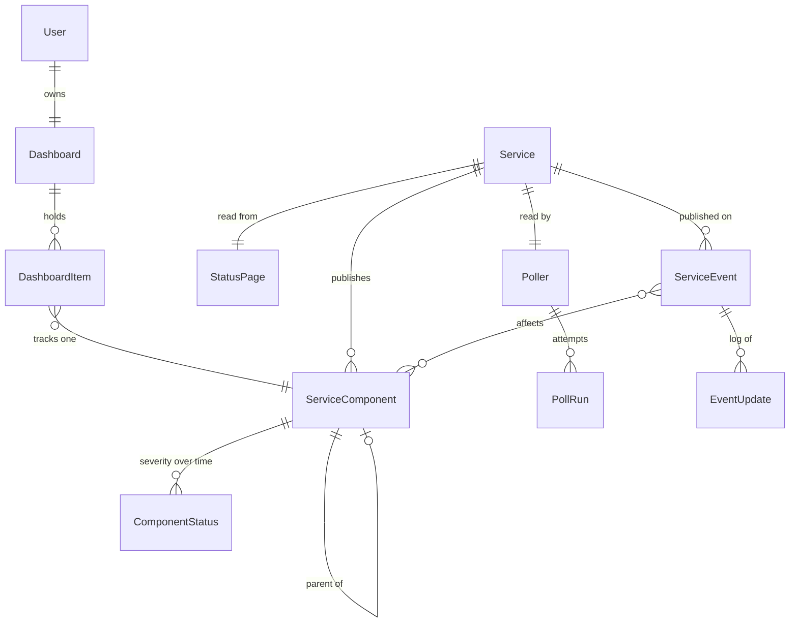
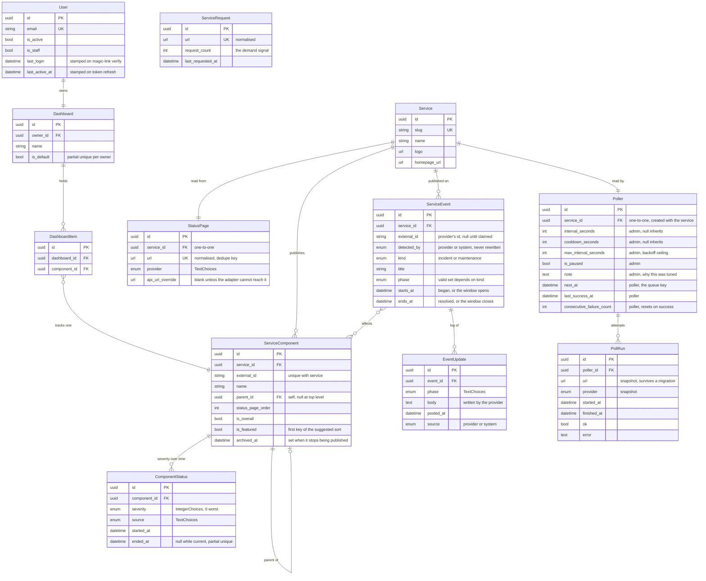

# Statusboard v1 — design spec

**Status:** approved design, ready for an implementation plan
**Date:** 2026-08-23

Statusboard is one place to see whether the services you depend on are working. You track
services from a catalog; the app refreshes them on a schedule and shows what is broken.

Designs, approved 2026-08-23:

- Mobile — <https://claude.ai/code/artifact/7900360b-d3bc-44ec-986b-d2152741c138> (Revision 51)
- Desktop — <https://claude.ai/code/artifact/f947e3ad-fcfc-4945-9bd5-38ca9284455c> (Draft 21)

---

## 1. Scope

### In v1

A personal status aggregator: sign in, track services or individual components, see their
current state, read the provider's incident log, and browse a public view without an account.

### Explicitly not in v1

| Deferred | Why |
| --- | --- |
| Shared dashboards, invites | Sub-project #2. The `Dashboard` model exists with one row per user so sharing needs no migration. |
| Community issue reporting, comments | Sub-project #3. The Figma set already contains `status dot - user reported`, a split-circle variant, so the dot component should accept a shape from day one. |
| Notifications | Sub-project #2. The Figma set contains a `Toggle Notifications` button; nothing in v1 uses it. |
| Uptime history charts | `ComponentStatus` accumulates from first poll, so any chart is empty on day one. Ships when there is data. |
| Service categories | Cut deliberately. `is_featured` plus `watcher_count` orders the suggested list instead. Both sit on `ServiceComponent`. |

### Non-goals

Statusboard does not measure uptime itself. It reads what providers publish. Every number it
shows is theirs, not ours.

---

## 2. Architecture

Monorepo, matching caracara and codecity:

```
statusboard/
├─ api/                    Django 5 + DRF
│  ├─ api/                 settings, celery.py, urls
│  ├─ common/              BaseModel, pagination, schema, mixins, Scalar docs
│  ├─ authentication/      User, magic link
│  ├─ catalog/             Service, StatusPage, ServiceComponent — what exists
│  ├─ polling/             Poller, PollRun, adapters/, reconcile, tasks — how we look
│  ├─ status/              ComponentStatus, ServiceEvent, EventUpdate — what we saw
│  └─ dashboards/          Dashboard, DashboardItem
├─ app/                    React + TS + Vite + Tailwind + TanStack Query + vite-plugin-pwa
├─ justfile                infisical run --env=dev wrapping everything
└─ docker-compose.yml      postgres 17, redis 7
```

Dependency direction: `status` never imports users, `catalog` never imports dashboards. That is
what makes sharing a change to `dashboards` alone.

### House conventions to follow

- `uv`, `ruff` (`extend-select = ["I","F"]`), pre-commit with markdownlint and whitespace hooks
- `django-unfold`, with per-environment static dirs and `ENVIRONMENT` callbacks
- `drf-spectacular` + Scalar at the root, with tag-group,
  logo and schema-name postprocessing hooks and a markdown introduction
- `dj-database-url`, `python-dotenv`, `psycopg2-binary`, `django-cors-headers`, `django-filter`
- `django-simple-history` on `catalog` models only
- `django-celery-beat` with `DatabaseScheduler`, so poll schedules are editable rows in admin
- Redis as the Celery broker (caracara uses RabbitMQ; Redis is already needed for throttling)
- Skip social/OAuth entirely

---

## 3. Data model

Every model extends `common.BaseModel`: UUID primary key, `created_at`, `updated_at`,
`created_by`, `updated_by`, `ordering = ["-created_at"]`.
`auth.Permission` and `ContentType` keep integer keys — that is Django, not a choice.

### authentication



Every field and relationship:



Every model above also carries `common.BaseModel`: `created_at`, `updated_at`,
`created_by`, `updated_by`. They are omitted so the diagram shows what distinguishes
each table.

Reading it:

- **A board row is a `ServiceComponent`**, never a `Service`. The overall component is one of
  these, so the arrow from `DashboardItem` has one destination.
- **`StatusPage` is separate from `Service`** because it is the *source*, and it is where the
  unique URL and the poller's state live.
- **`parent` is the whole tree.** `?ancestor=` and every descendant count read any depth from
  it, with one recursive query. A stored copy of the answer needed a writer on every path that
  could move a component, and it was wrong until that writer ran.
- **`ComponentStatus` is append-only**, one row per severity change, with a partial unique index
  marking the current one. Current state and history are the same table.

- **`ServiceEvent` is one model for incidents and maintenance**, because a provider publishes them
  as one object. `kind` separates them; the API and the screens filter on it.


`User(BaseModel, AbstractUser)` with a UUID pk and email as the login field.

**Activity is tracked in two fields, both written without a per-request cost.**

`last_login` comes with `AbstractUser`, but Django only sets it inside
`django.contrib.auth.login()`, which magic-link auth never calls — it mints tokens on verify. It is
stamped explicitly there, or it stays null forever.

`last_active_at` is stamped on `POST /auth/refresh/`. The client rotates a 15-minute access token,
so that endpoint is already a heartbeat throttled to once per session per 15 minutes. No
middleware, no write on every request, no throttling logic to tune.

Neither is exposed on `/me/`; nothing in the app renders them. They exist for admin: seeing whether
an account is live, and finding dormant ones. Django's stock
`auth.Group`, unregistered and re-registered with Unfold's admin. No custom Group: it is not
swappable, and the thing worth extending later is `DashboardMembership` in `dashboards`, which
is a different concept from a permission role.

### catalog

- `Service` — slug, name, logo, homepage URL

  `logo` comes from the provider's page and is refreshed on every poll, so a rebrand upstream does
  not leave a stale entry in the catalogue.

  Three earlier fields are gone. `added_by` duplicated `BaseModel.created_by`, which every model
  already carries. `is_curated` had no consumer: nothing sorted, filtered or rendered by it.
  "Seeded by us rather than pasted by someone" is `created_by IS NULL`. `watcher_count` was a
  column a signal kept true, and four write paths never reached the signal. It is counted when it
  is read instead.
- `StatusPage` — **its own model**, `OneToOneField` to `Service`. `url` (normalised, **unique**),
  `provider`, `api_url_override` (blank unless needed). What and where — nothing about polling.
- `Poller` — `OneToOneField` to **`Service`**, created with it. The thing that reads a service:
  how often, when next, and how it is going.

  On the service, not the page, for the reason `PollRun` is: the schedule answers "how often do we
  check Twilio", which outlives any particular page. A service migrating from Statuspage to
  Instatus keeps its tuning and its `note`, and the poller's schedule and its history stay at the
  same level.

  | field | who writes it |
  | --- | --- |
  | `interval_seconds` | admin — null inherits the `/meta/` default |
  | `cooldown_seconds` | admin — null inherits |
  | `max_interval_seconds` | admin — the backoff ceiling, null inherits |
  | `is_paused` | admin |
  | `note` | admin |
  | `next_at` | poller — the scheduler's queue key |
  | `last_success_at` | poller |
  | `consecutive_failure_count` | poller — resets to zero on success |

  ```python
  interval = service.poller.interval_seconds or meta.poll_interval_seconds
  ```

  **A null field means "inherit"**, and there is exactly one way to say it. An earlier draft made
  the row itself optional, so "not tuned" could be a missing row *or* a row full of nulls — two
  absences for one fact, plus a null check on the relation in front of every read.

  That is the layering a single effective column could not express: `/meta/` holds the deployment
  default, this holds a deliberate choice, and the effective interval is computed from both plus
  the backoff. Nothing before recorded that an admin *chose* 60s rather than inheriting 300s.

  Settings and state live together because they are one thing — the poller — read together on
  every pass. Splitting them was a second one-to-one row for the same object, which bought a join
  and nothing else.

  **`PollRun` hangs off the `Poller`**, not off `Service` directly. A run is an attempt this poller
  made, so its history belongs to it. The poller is one-to-one with the service and created with
  it, so that history still survives a page migration — which is what putting runs on `Service`
  was protecting.

  `is_paused` stops polling without deleting the service: a status page that has gone for good, or
  one rate-limiting us hard enough to be worth leaving alone. `note` is why — a tuned value with no
  reason attached becomes undeletable, because nobody later knows whether it still matters.

  `consecutive_failure_count` is a denormalised count of `PollRun`, kept because the scheduler
  reads it every cycle; deriving it would be a count-since-last-success query per service per tick.
  It drives the backoff that scales the interval, and tips a component to severity 3 once the data
  is too stale to trust.

  A `last_error` column was dropped for failing that same test: it is the newest `PollRun.error`,
  read only in admin, and a copy that can disagree with the row it came from.

- `ServiceComponent` — `service`, `external_id`, `name`, self-FK `parent`, `status_page_order`,
  `is_overall`, `archived_at`. Unique on `(service, external_id)`.

  `external_id` is the provider's own id for the thing, carried on components, incidents and
  maintenance windows alike. It says the id is **not ours**, which `status_page_component_id`
  would only say for components, and which `status_page_id` would say wrongly — that reads as a
  foreign key to `StatusPage`.

  There is no `is_group` flag: a component is a group when it has children, so the flag would be a
  second copy of a fact the tree already holds.

  `status_page_order` is the position the provider lists a component in, and it is the components
  tab's default sort. That ordering carries the provider's judgement about what matters —
  Twilio puts *Programmable Messaging* near the top and regional endpoints near the bottom.
  Sorted by name you get *API, Console, Elastic SIP, Lookup*, which is a different page from the
  one the user just came from. Severity and name remain available.

  It is also the only ordering that cannot be reconstructed later: it exists only in the payload
  being parsed, and one integer written during the upsert that already reconciles names and
  parents costs nothing to keep in step.

Custom URLs dedupe on `StatusPage.url`, so two users pasting the same status page share one
`Service` and one poll. A popular pasted entry is surfaced by ticking `is_featured` on its overall
component in admin.

**Suggestion ordering** is `(-is_featured, severity, -watcher_count, name)`, over components.

**`watcher_count` is distinct users, not items.** Someone tracking one component from two
boards is one watcher, not two:

```sql
SELECT COUNT(DISTINCT d.owner_id)
FROM   dashboards_dashboarditem i
JOIN   dashboards_dashboard d ON d.id = i.dashboard_id
WHERE  i.component_id = %s
```

It is counted when the list is read, so it is exact. There is no column and no signal to
keep one true.

On day one every `watcher_count` is zero, so the list is your featured picks followed by
everything else alphabetically. As real usage arrives the tail self-orders and you stop curating.
Nothing about the API changes at that point — it is the same query.

An earlier draft used a manual integer `featured_rank`. That is worse: it needs renumbering every
time something is promoted, and a value of 37 carries no meaning to whoever inherits it.

### dashboards

- `Dashboard` — owner, name, `is_default`. Exactly one per user in v1.

  ```python
  constraints = [
      UniqueConstraint(fields=["owner"], condition=Q(is_default=True),
                       name="one_default_dashboard_per_user"),
  ]
  ```

  `GET /me/` returns `default_dashboard_id`, which today can only mean "the only one". The flag
  makes it a real lookup, so the day a second board exists nothing about that endpoint changes.

  An earlier draft had `position` instead, left over from the multi-dashboard concept that was cut
  — it ordered boards in a switcher. With one board there is nothing to order, and a default is
  the part of that idea worth keeping.
- `DashboardItem` — dashboard, **component**

  Every row is a component. There is no nullable service field and no "is this a service or a
  component" discriminator, because a service's overall status is itself a component — see below.

  No `position`: nothing in the design lets you hand-order a board. Rows are sorted by severity or
  name, server-side. If manual ordering is ever wanted it arrives with the UI that needs it.

Unique on `(dashboard, component)`.

### Every service has an overall component

Statusboard creates one component per service, `is_overall = true`, `parent = null`, named
"All services". `path` is empty, since it has no ancestry. `descendant_count` is always 0. It is
a peer of the top-level components rather than their parent. A database trigger refuses a
component parented under it.

**`component_count` excludes it.** The number equals what the provider's own status page claims,
which is the number a user can check. The components list returns the overall row first and does
not count it in `aggregates.total`, so a page holds one more row than its count. It carries **the provider's own top-level indicator** — not an aggregate of its
siblings, because a worst-of rollup leaves Cloudflare permanently orange when one of 109
components is always degraded.

**Not every provider publishes one, so `status.source` says where a severity came from.**

| `source` | when | severity |
| --- | --- | --- |
| `provider` | the provider publishes a top-level status | theirs |
| `components` | it publishes component statuses but no top-level one | worst of the components |
| `incidents` | it publishes incidents only, no status at all | 2 if any incident is open, else 5 |

`incidents` is the RSS case. A feed we fetched is **not** unknown — it told us something. Clean
feed means nothing is reported wrong; an open entry means something is. What it cannot say is how
bad, so an open incident is `degraded` and no other severity is inferred from it.

`unknown` keeps its own meaning: we could not reach the provider. That is the only case where we
have no data at all.

**RSS ships in v1.** An RSS service shows only Operational or Degraded, and says so via
`status.source`. That is a narrower signal than a Statuspage service gives, but it is a real one,
and it is the difference between a service being in the catalog and not.

A screen showing a derived status says so. "Degraded" from a published indicator and "Degraded"
because an RSS entry exists are different claims, and a user who clicks through to a provider's
page and finds no status there should not feel misled.

This is why the board model is as simple as it is. "Track Twilio" and "track Twilio SMS" are the
same operation with a different id, so:

- A tracked row points at one thing, not one-of-two
- Every board endpoint is `/dashboards/{uuid}/components/`, because every row *is* a component
- A board row has no `kind` to branch on, and the client never picks an endpoint by row type

An earlier draft had items point at *either* a service or a component. That forced a
discriminator on every row, an either/or request body, and a client that had to decide which shape
to send. The overall component removes all three.

**There are no bulk endpoints and no aliases.** One `POST` creates one item; one `DELETE` removes
one. "Add all" and "Remove all" are the client repeating those calls, so there is never a decision
about which endpoint to use. The cost is honest: removing a service with 42 tracked components is
42 requests. They are small, they parallelise, and it is a rare action — cheaper than an API
where every add has two possible shapes.

### status

- `ComponentStatus` — append-only, one row per severity change. Each row is an interval:
  `started_at`, and `ended_at` which is null while it is the live one.

  ```python
  class Meta:
      constraints = [
          UniqueConstraint(fields=["component"], condition=Q(ended_at__isnull=True),
                           name="one_open_status_per_component"),
      ]
      indexes = [
          Index(fields=["severity"], condition=Q(ended_at__isnull=True), name="open_by_severity"),
      ]
  ```

  A change stamps `ended_at` on the open row and inserts a new one. Nothing is written when
  severity is unchanged, so a service that is fine all week costs no rows.

  **`ended_at IS NULL` is the only definition of "current".** An earlier draft carried an
  `is_current` boolean as well, which is two columns for one fact and two things to disagree.

  A closed row is then a self-contained interval. "Was it degraded at 14:00" is
  `started_at <= T < ended_at`, an index-friendly range query, and uptime is a sum of durations —
  neither needs a window function nor a lookahead to the next row.

  The partial unique index makes "exactly one open row per component" a database guarantee. The
  partial index on `severity` keeps Discover fast: `WHERE ended_at IS NULL AND severity <= 3`
  filters the whole catalogue without a latest-per-group query.

  The manager defaults to the open row. A query that wants history asks for it by name.
- `ServiceEvent` — FK to **`Service`**, `external_id`, `kind`, `title`, `phase`, `starts_at`,
  `ends_at`, M2M `affected_components`; `EventUpdate` child for the log

  **One model for incidents and maintenance windows**, because that is how providers publish them.
  On Atlassian Statuspage a scheduled maintenance *is* an incident — same object, a maintenance
  impact, a scheduled window, the same update log. Two tables meant two ingestion paths for one
  payload, and two near-identical shapes to keep in step.

  `kind` is `incident` or `maintenance`. `phase` is a `TextChoices` whose valid values depend on
  it: `investigating, identified, monitoring, resolved` for an incident; `scheduled, in_progress,
  verifying, completed` for maintenance. Validated on save, so the pair cannot drift into a
  meaningless combination.

  `starts_at` and `ends_at` are one interval either way — when an incident began and resolved, or
  when a window opens and closes. That is what lets one query answer "what is happening to this
  service between now and Thursday" without a union.

  **Both belong to the service, and both frequently name no component at all** — "Scheduled
  maintenance, Sunday 02:00" against the whole service, or "investigating elevated error rates"
  before anyone knows where. An FK to a component could hold neither, and would need six rows for
  an event touching six components. So `affected_components` is many-to-many, and
  `Component.active_incident` and `Component.upcoming_maintenance` are both **projections through
  it**, filtered by `kind`. On the overall component they cover the whole service, which is where
  an unattributed event appears.

  **The API is one collection too.** `/catalog/services/{slug}/events/` lists both, and `kind`
  filters. The service screen reads it twice: the Incidents tab with `kind=incident`, the
  Maintenance tab with `kind=maintenance`. Each groups by phase and renders each event's `updates`
  log, so `aggregates.by_phase` supplies the "ACTIVE 2" heading.

  Neither tab needs a count from this endpoint. `overall_component.active_incident_count` and
  `overall_component.upcoming_maintenance_count` arrive with the service, so the tab bar draws
  before either request is made — which is why `EventAggregates` carries no `by_kind`.

  Home's tabs do not use this endpoint at all. They filter components, because a board row is a
  component — see *The tabs are one axis*.

  Two endpoints would have been the same split as two tables, one layer up: two paths, two
  filtersets and two serializers over one model.

- `PollRun` — FK to **`Service`**, per-attempt success/error, plus the `url` and `provider` it
  actually fetched

  It answers "could we check Twilio", which outlives any particular page. A service that migrates
  from Statuspage to Instatus keeps its history; an FK to `StatusPage` would be one cascade from
  losing it.

  The snapshotted `url` and `provider` are what makes that history still readable afterwards — a
  run from before the migration says which page it read.

  `StatusPage` holds the rolled-up state (`poll_consecutive_failure_count`, `poll_last_success_at`); `PollRun`
  holds the attempts. This is what makes "everything is fine" distinguishable from "we have not
  successfully checked in six hours".

#### Four kinds of record, and how to tell them apart

Three of these are append-only logs, which is why they blur. What separates them is **whose record
it is and what it holds**.

| model | whose | holds | written when |
| --- | --- | --- | --- |
| `ComponentStatus` | ours | a severity, no prose | only when severity changes |
| `EventUpdate` | **theirs** | a paragraph they wrote, and a phase | when the provider posts one |
| `PollRun` | ours | did the fetch succeed, and of what URL | every attempt, success or failure |

`ComponentStatus` is us diffing two polls. `EventUpdate` is ingested verbatim, carrying the
provider's own `external_id`. They come apart constantly: a component flaps with no incident open
and you get status rows but no updates; a provider posts "monitoring a fix" while every component
reads operational and you get updates but no status rows.

`PollRun` is the third axis and is about neither — it records whether we could *read* the page. It
is what makes "everything is fine" distinguishable from "we have not successfully checked in six
hours", which look identical if you only store status.

An earlier draft split current state and history into two tables, `ComponentStatus` and
`StatusEvent`, so that filtering the catalogue by current severity had a small table to index. The
partial index does that in one table, and removes the risk of the two disagreeing — there is only
one write path now, and the unique constraint enforces the invariant that the two-table version
asked the polling code to maintain.

**Nothing is written on an unchanged poll.** A row per poll would be 12 components × 288 polls a
day, about 630M rows a year across 500 services, nearly all identical to the row before them.
"When did we last check" does not need to be there: `StatusPage.poll_last_success_at` answers it,
because one fetch covers every component of a service.

### Status and incidents are different things

They are not derived from each other and neither is computed from the other.

A **status** is the current state of a service or component, as the provider reports it —
`operational`, `degraded`, and so on.

An **incident** is the provider's narrative record: a title, a start time, affected components,
and a running log of updates. Its `phase` is workflow — `investigating`, `identified`,
`monitoring`, `resolved`.

They move independently. A provider can be `monitoring` a fix while every component already reads
`operational`, and can report `degraded` with no incident open at all. Statusboard shows both and
never infers one from the other — which is why the service screen has separate Components and
Incidents tabs rather than one merged list.

### Every fixed set is a choices class

`severity` is `models.IntegerChoices`; `status.source`, `status_page.provider` and `incident.phase`
are `models.TextChoices`. None of them is a bare string with values enforced by convention.

That is what lets a set grow in one place. Adding a provider means one line in the class, and
Django, drf-spectacular and the admin all pick it up — the OpenAPI `enum`, the admin filter and the
validation come from the same declaration. `severity` as `IntegerChoices` also puts the labels next
to the numbers, which is where `/meta/` reads them from.

The `PollRun.provider` snapshot uses the same class, so a historical row is readable against the
current vocabulary rather than being a loose string nobody validates.

### Normalised status

| Status | Severity | Colour |
| --- | --- | --- |
| `major_outage` | 0 | `#E51F00` |
| `partial_outage` | 1 | `#E58900` |
| `degraded` | 2 | `#E58900` |
| `unknown` | 3 | `#808080` |
| `maintenance` | 4 | `#00A0E5` |
| `operational` | 5 | `#00E54D` |

**Lower is worse**, matching the SEV0/SEV1 convention people arrive with. Sorting worst-first is
`ORDER BY severity ASC`, and `severity <= 3` is everything needing attention — which is also why `unknown`
sits at 3 rather than beside `operational`: a service we cannot reach belongs with the problems,
not with the healthy ones.

**An "All services" row uses the provider's own top-level indicator, never the worst of its
components.** A worst-of-components rollup leaves Cloudflare permanently orange, because something among
109 components almost always is.

---

## 4. Provider adapters and polling

### Adapters

One class per provider, same interface: given a URL, return normalised components and incidents.

- `StatuspageAdapter` — Atlassian's `/api/v2/summary.json` and `/api/v2/incidents.json`. Covers
  most of the industry.
- `InstatusAdapter`, `BetterStackAdapter`
- `RSSAdapter` — fallback. Returns incidents and no component status. Its services get one
  synthetic component, the overall one, with `status.source = incidents`: severity 2 while an
  incident is open, severity 5 otherwise.

Each exposes `fetch_status()` and `fetch_incidents()`. Adding provider #5 is one new class.

`POST /catalog/import/` detects the provider from a pasted URL and creates the service.

### Keeping names and component trees current

Providers rename services, add components and retire them. A poll is therefore a reconciliation,
not just a status read.

Each successful poll:

1. **Upserts components by `external_id`.** New ones are created, renames are applied, and the
   parent/child structure and `status_page_order` are refreshed.
2. **Marks vanished components `archived_at`** rather than deleting them. Someone may be tracking
   one, and deleting the row would silently remove it from their board. An archived component
   still renders, reads `unknown`, and says the provider no longer publishes it.
3. **Refreshes the service's own metadata** — name, homepage URL, logo — for seeded and pasted
   entries alike, so a rename upstream does not leave a stale name on someone's board.

Component identity is the provider's `external_id`, never the display name. Names change; ids do
not, and matching on names would orphan a tracked row the first time a provider edits its wording.

### Polling

**There is one global schedule, not a schedule per user or per dashboard.** A service is polled
because *someone* tracks it, not because a particular board is open. Two hundred users tracking
Twilio produce one poll every five minutes, not two hundred.

`django-celery-beat` on `DatabaseScheduler`. Rules:

- Poll only services with at least one watcher
- Five-minute default interval, with jitter so we do not stampede
- Honour `ETag` / `If-Modified-Since`
- Exponential backoff on failure. **The service screen shows the effective interval, not the
  deployment default** — `Service.poller.interval_seconds`. A service in backoff is not being
  checked every five minutes, and that is precisely the service someone opens to ask why.
- **A hard per-service cooldown, global across all users**

A failed fetch sets `unknown` and **never clobbers the last known value**. The UI shows the grey
state plus how long it has been stale.

**The cooldown stays on the service, globally.** The thing needing protection is somebody
else's status page. A per-user or per-board limit would poll one service twice for two
boards that both track it.

A poll also captures the service's **logo** from its own page. A favicon belonging to the parent
company rather than the product — Google's mark for Google Slides — is discarded rather than
stored: a wrong logo misidentifies the row, while a missing one falls back to an initial and
merely looks incomplete.

## 5. The API, the client and the design system

Those three sections are now
[`2026-09-03-statusboard-client-design.md`](2026-09-03-statusboard-client-design.md).

They described a palette, tabs and a row that the approved decks replaced on 2026-08-28.
Keeping a second account of one API is how two answers to the same question drift apart.

---

## 6. Testing, infra, deploy

### Testing

pytest + pytest-django + factory_boy + xdist + randomly, with codecity's coverage gate. TDD.

**Adapters are the risky surface**, so they are tested against recorded fixtures — real captured
JSON from Twilio, GitHub, Cloudflare — with **zero network in the test suite**. Frontend: vitest +
testing-library + MSW.

### Infra

docker-compose runs postgres and redis; Django runs on the host via `runserver`, matching
reactionchat-api. `just init` → `uv sync --locked` → `pre-commit install` → `migrate` →
`loaddata local_dev` → `collectstatic`.

### Email

Magic link needs a real provider (Resend or Postmark) before anyone but you can sign in. Local dev
uses Django's console backend, so it blocks nothing during development, but it is a deploy-day
prerequisite.

### Operational honesty

We are the thing that tells you when services break, so we cannot quietly break ourselves.
`PollRun` errors surface in admin, and a service failing N consecutive polls is visibly flagged
rather than silently showing stale green.

---

## Open questions

1. **Icon weight** — filled Figma marks beside stroked Lucide icons in the same nav.
2. **Suggestion quality** — featured plus watcher count is a starting point, not a ranking
   algorithm. Worth revisiting once there is enough usage for the tail to be meaningful.
3. **Corner-notch card treatment** — explored and set aside; revisit against the real `.row`
   component rather than a copy.
